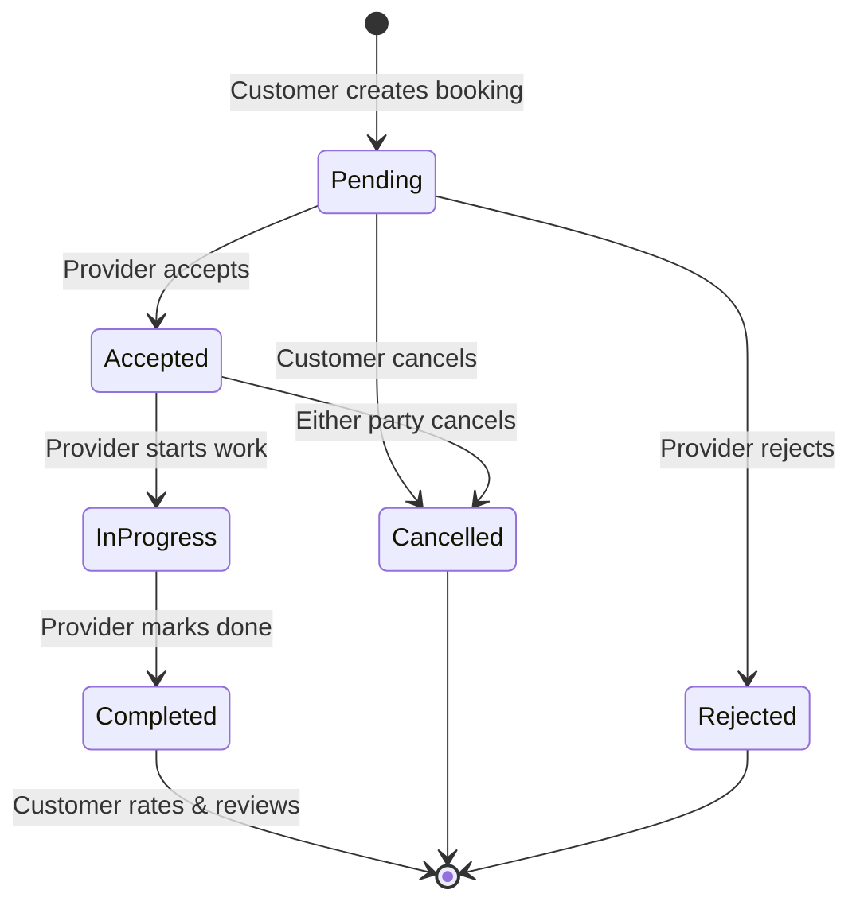

# 📋 ServiceHub — Product Requirements Document (PRD)

> **Version:** 1.0  
> **Last Updated:** July 21, 2026  
> **Project Name:** ServiceHub  
> **Type:** On-Demand Home Services Marketplace  
> **Status:** 🟡 Active Development  

---

## 1. Product Overview

### 1.1 Vision
ServiceHub ek **on-demand home services marketplace** hai jahan customers apne ghar ke liye services (Plumbing, Electrical, AC Repair, Cleaning, Carpentry, Painting, Appliance Repair) book kar sakte hain aur verified service providers un requests ko accept karke service provide karte hain.

### 1.2 Problem Statement
- Customers ko reliable aur verified service providers dhundhne mein mushkil hoti hai
- Service providers ke paas ek organized platform nahi hota customers tak pahunchne ke liye
- Booking, payment, aur communication ka koi centralized system nahi hota

### 1.3 Solution
Ek **3-sided marketplace** platform jo connect kare:
1. **Customers** — jo services book karna chahte hain
2. **Service Providers** — jo services provide karte hain
3. **Admins** — jo poora ecosystem manage karte hain

---

## 2. System Architecture

### 2.1 High-Level Architecture

```
┌──────────────────────────────────────────────────────────────────┐
│                      ServiceHub Platform                        │
├───────────────┬───────────────┬──────────────┬──────────────────┤
│  Customer App │  Provider App │  Admin Panel │    Backend API   │
│  (React Native│  (React Native│   (React +   │  (Node.js +      │
│    + Expo)    │    + Expo)    │    Vite)     │  Express + MongoDB)│
└───────┬───────┴───────┬───────┴──────┬───────┴────────┬─────────┘
        │               │              │                │
        └───────────────┴──────────────┴────────────────┘
                                │
                    ┌───────────┴───────────┐
                    │  REST API + Socket.IO │
                    │  (Real-time Events)   │
                    └───────────┬───────────┘
                                │
                    ┌───────────┴───────────┐
                    │      MongoDB          │
                    │   (Database Layer)    │
                    └───────────────────────┘
```

### 2.2 Tech Stack

| Layer           | Technology                                          |
|-----------------|-----------------------------------------------------|
| **Customer App**| React Native + Expo (TypeScript), React Navigation  |
| **Provider App**| React Native + Expo (TypeScript/JS), Expo Router    |
| **Admin Panel** | React 19 + Vite 8, Lucide Icons                     |
| **Backend API** | Node.js, Express.js 4.x                              |
| **Database**    | MongoDB (Mongoose ODM)                                |
| **Real-time**   | Socket.IO (Chat & Live Notifications)                |
| **Auth**        | JWT (JSON Web Tokens) + bcrypt                       |
| **Security**    | Helmet, Rate Limiting, CORS, express-validator       |
| **Payments**    | Online + Cash (UPI Integration Ready)                |
| **Logging**     | Morgan (HTTP request logger)                         |

### 2.3 Project Structure

```
startup/
├── backend/                 # Node.js + Express API Server
│   ├── config/              # Database configuration
│   ├── controllers/         # Business logic
│   │   ├── authController.js
│   │   ├── bookingController.js
│   │   ├── paymentController.js
│   │   └── serviceController.js
│   ├── middleware/           # Auth & role-based access
│   ├── models/              # Mongoose schemas
│   │   ├── User.js          # Customer + Provider + Admin (unified)
│   │   ├── Booking.js       # Booking lifecycle
│   │   ├── Service.js       # Service catalog
│   │   ├── Category.js      # Service categories
│   │   ├── Provider.js      # Legacy provider model
│   │   └── Message.js       # Chat messages
│   ├── routes/              # API route definitions
│   ├── utils/               # Helper utilities
│   ├── seed.js              # Database seeder
│   └── server.js            # Entry point + Socket.IO setup
│
├── customer-app/            # React Native (Expo) — Customer
│   └── src/
│       ├── api/             # API service layer
│       ├── components/      # Reusable UI components
│       ├── context/         # React Context (Auth, etc.)
│       ├── hooks/           # Custom hooks
│       ├── navigation/      # Navigation configuration
│       ├── screens/
│       │   ├── auth/        # Login, Register, Forgot Password
│       │   └── customer/    # Home, Search, Booking, Chat, Profile, etc.
│       ├── services/        # External service integrations
│       └── utils/           # Utility functions
│
├── provider-app/            # React Native (Expo) — Provider
│   └── app/
│       ├── (auth)/          # Auth screens (Expo Router)
│       ├── (tabs)/          # Tab screens (Home, Bookings, Profile)
│       ├── components/      # Provider-specific components
│       ├── context/         # Auth context
│       ├── services/        # API service layer
│       └── utils/           # Utilities
│
└── admin-panel/             # React + Vite — Web Admin
    └── src/
        ├── context/         # Admin auth context
        └── pages/           # Dashboard, Users, Services, Bookings
```

---

## 3. Data Models

### 3.1 User Model (Unified — Customer + Provider + Admin)

| Field                     | Type       | Description                              |
|---------------------------|------------|------------------------------------------|
| `name`                    | String     | Full name (required)                     |
| `email`                   | String     | Unique email (required, validated)       |
| `phone`                   | String     | 10-digit phone number (required)         |
| `password`                | String     | Hashed (bcrypt, min 6 chars)             |
| `role`                    | Enum       | `customer` / `provider` / `admin`        |
| `isVerified`              | Boolean    | Account verification status              |
| `isActive`                | Boolean    | Active/blocked status                    |
| `profileImage`            | String     | Profile picture URL                      |
| `expoPushToken`           | String     | Push notification token                  |
| `address`                 | Object     | street, city, state, pincode, coordinates|
| `providerDetails`         | Object     | Provider-specific nested object (below)  |

#### Provider Details (Nested in User)

| Field                        | Type       | Description                           |
|------------------------------|------------|---------------------------------------|
| `services`                   | [ObjectId] | Linked Service IDs                    |
| `experience`                 | String     | Work experience                       |
| `shopName`                   | String     | Business/shop name                    |
| `ownerName`                  | String     | Owner's name                          |
| `description`                | String     | Business description                  |
| `workingHours`               | String     | e.g., "9:00 AM - 8:00 PM"            |
| `weeklyOff`                  | String     | Weekly off day                        |
| `upiId`                      | String     | UPI ID for payments                   |
| `gstNumber`                  | String     | GST number                            |
| `businessRegistrationNumber` | String     | Business registration                 |
| `bannerImage`                | String     | Shop banner image URL                 |
| `aadhaarNumber`              | String     | Aadhaar number                        |
| `aadhaarCardImage`           | String     | Aadhaar card image URL                |
| `documents`                  | [Object]   | Uploaded documents                    |
| `isApproved`                 | Boolean    | Admin approval status                 |
| `rating`                     | Number     | Average rating (0-5)                  |
| `totalReviews`               | Number     | Total review count                    |
| `isOnline`                   | Boolean    | Online/offline availability           |

### 3.2 Service Model

| Field         | Type       | Description                                              |
|---------------|------------|----------------------------------------------------------|
| `name`        | String     | Service name (required)                                  |
| `category`    | Enum       | `plumbing`, `electrical`, `ac_repair`, `cleaning`, `carpentry`, `painting`, `appliance`, `other` |
| `description` | String     | Service description                                      |
| `price`       | Number     | Base price (₹)                                           |
| `unit`        | Enum       | `hour` / `visit` / `project`                             |
| `duration`    | String     | Estimated duration (e.g., "1-2 hours")                   |
| `includes`    | [String]   | What's included in the service                           |
| `image`       | String     | Service image URL                                        |
| `rating`      | Number     | Average rating                                           |
| `reviews`     | Number     | Total reviews                                            |
| `isActive`    | Boolean    | Active status                                            |
| `featured`    | Boolean    | Featured on homepage                                     |

### 3.3 Booking Model

| Field                | Type       | Description                                       |
|----------------------|------------|---------------------------------------------------|
| `customerId`         | ObjectId   | Reference to customer (User)                      |
| `providerId`         | ObjectId   | Reference to provider (User)                      |
| `serviceId`          | ObjectId   | Reference to Service                              |
| `customerName`       | String     | Denormalized customer name                        |
| `customerPhone`      | String     | Denormalized customer phone                       |
| `status`             | Enum       | `pending` → `accepted` → `in_progress` → `completed` / `cancelled` / `rejected` |
| `scheduledDate`      | Date       | Service date                                      |
| `scheduledTime`      | String     | Service time slot                                 |
| `address`            | Object     | Service location (street, city, pincode, coords)  |
| `notes`              | String     | Customer notes                                    |
| `totalAmount`        | Number     | Total booking amount (₹)                          |
| `paymentMethod`      | Enum       | `cash` / `online`                                 |
| `paymentStatus`      | Enum       | `pending` / `paid` / `failed`                     |
| `paymentDetails`     | Object     | orderId, paymentId, verifiedAt                    |
| `cancellationReason` | String     | Reason if cancelled                               |
| `rating`             | Number     | Post-service rating (0-5)                         |
| `review`             | String     | Post-service review text                          |

### 3.4 Message Model (Chat)

| Field       | Type       | Description                    |
|-------------|------------|--------------------------------|
| `bookingId` | ObjectId   | Associated booking             |
| `senderId`  | ObjectId   | Message sender (User)          |
| `text`      | String     | Message content                |
| `createdAt` | Date       | Timestamp                      |

### 3.5 Category Model

| Field         | Type       | Description                  |
|---------------|------------|------------------------------|
| `name`        | String     | Category name                |
| `icon`        | String     | Category icon identifier     |
| `description` | String     | Category description         |

---

## 4. API Endpoints

### 4.1 Authentication (`/api/v1/auth`)

| Method | Endpoint                  | Auth  | Description                       |
|--------|---------------------------|-------|-----------------------------------|
| POST   | `/register`               | ❌    | Register new user                 |
| POST   | `/login`                  | ❌    | Login user                        |
| GET    | `/me`                     | ✅    | Get current user profile          |
| PUT    | `/profile`                | ✅    | Update user profile               |
| POST   | `/forgot-password`        | ❌    | Request password reset            |
| POST   | `/reset-password`         | ❌    | Reset password with code          |
| POST   | `/customer/register`      | ❌    | Register as customer (role-based) |
| POST   | `/customer/login`         | ❌    | Login as customer                 |
| POST   | `/provider/register`      | ❌    | Register as provider              |
| POST   | `/provider/login`         | ❌    | Login as provider                 |

### 4.2 Services (`/api/v1/services`)

| Method | Endpoint       | Auth  | Description                    |
|--------|----------------|-------|--------------------------------|
| GET    | `/`            | ❌    | Get all active services        |
| GET    | `/search`      | ❌    | Search services                |
| GET    | `/categories`  | ❌    | Get all service categories     |
| GET    | `/:id`         | ❌    | Get service by ID              |

### 4.3 Bookings (`/api/v1/bookings`)

| Method | Endpoint             | Auth     | Role      | Description                |
|--------|----------------------|----------|-----------|----------------------------|
| POST   | `/`                  | ✅       | Customer  | Create new booking         |
| GET    | `/customer`          | ✅       | Customer  | Get customer's bookings    |
| GET    | `/provider`          | ✅       | Provider  | Get provider's bookings    |
| PUT    | `/:id/status`        | ✅       | Any       | Update booking status      |
| POST   | `/:id/review`        | ✅       | Customer  | Add rating & review        |
| GET    | `/:id/messages`      | ✅       | Any       | Get booking chat messages  |

### 4.4 Payments (`/api/v1/payments`)

| Method | Endpoint    | Auth  | Description                    |
|--------|-------------|-------|--------------------------------|
| POST   | `/order`    | ✅    | Create payment order           |
| POST   | `/verify`   | ✅    | Verify payment                 |

### 4.5 Admin (`/api/v1/admin`)

| Method | Endpoint                    | Auth       | Description                       |
|--------|-----------------------------|------------|-----------------------------------|
| GET    | `/dashboard`                | ✅ Admin   | Get dashboard statistics          |
| GET    | `/stats/pending`            | ✅ Admin   | Pending stats + weekly chart data |
| GET    | `/users`                    | ✅ Admin   | List all users                    |
| PUT    | `/users/:id/status`         | ✅ Admin   | Activate/deactivate user          |
| GET    | `/bookings`                 | ✅ Admin   | List all bookings                 |
| PUT    | `/bookings/:id/status`      | ✅ Admin   | Update booking status (disputes)  |
| GET    | `/services`                 | ✅ Admin   | List all services                 |
| POST   | `/services`                 | ✅ Admin   | Create new service                |
| PUT    | `/services/:id`             | ✅ Admin   | Update service                    |
| DELETE | `/services/:id`             | ✅ Admin   | Delete service                    |
| PUT    | `/providers/:id/approve`    | ✅ Admin   | Approve/reject provider           |

### 4.6 Health Check

| Method | Endpoint          | Description              |
|--------|-------------------|--------------------------|
| GET    | `/api/v1/health`  | Server health & uptime   |

---

## 5. Feature Breakdown by Module

### 5.1 📱 Customer App (React Native + Expo)

| Screen                 | Features                                                     |
|------------------------|--------------------------------------------------------------|
| **LoginScreen**        | Email/password login, role-based auth, forgot password link  |
| **RegisterScreen**     | Name, email, phone, password, role selection                 |
| **ForgotPasswordScreen**| Email-based password reset flow                             |
| **HomeScreen**         | Featured services, categories, search bar, service grid      |
| **SearchScreen**       | Service search with filtering                                |
| **ServiceDetailScreen**| Service details, provider info, pricing, "Book Now" CTA     |
| **BookServiceScreen**  | Date/time picker, address input, notes, payment method       |
| **MyBookingsScreen**   | Active + past bookings with status tracking                  |
| **BookingDetailScreen**| Full booking info, status timeline, actions                  |
| **BookingHistoryScreen**| Completed booking history                                   |
| **ChatScreen**         | Real-time chat with provider (Socket.IO)                     |
| **RatingScreen**       | Post-service rating (1-5 stars) + text review                |
| **PaymentModal**       | Payment method selection, UPI/online flow                    |
| **MapPicker**          | Location picker for service address                          |
| **ProfileScreen**      | View/edit profile, address, logout                           |

### 5.2 🔧 Provider App (React Native + Expo)

| Screen              | Features                                                        |
|---------------------|-----------------------------------------------------------------|
| **Auth (Login/Register)** | Provider-specific registration with business details      |
| **Home (Dashboard)**| Incoming requests, today's schedule, earnings summary            |
| **Bookings**        | View pending/accepted/completed bookings, accept/reject actions  |
| **Chat**            | Real-time communication with customers                           |
| **Profile**         | Shop details, working hours, UPI ID, Aadhaar, documents         |

### 5.3 🖥️ Admin Panel (React + Vite — Web)

| Page              | Features                                                          |
|-------------------|-------------------------------------------------------------------|
| **Dashboard**     | Stats cards (Users, Providers, Bookings, Revenue), weekly chart   |
| **Users**         | List all users, filter by role, activate/deactivate, approve providers |
| **Services**      | CRUD operations on service catalog                                |
| **Bookings**      | View all bookings, update status for dispute resolution           |

---

## 6. Real-time Features (Socket.IO)

```
┌─────────────────────────────────────────────────────┐
│                 Socket.IO Events                     │
├──────────────────────┬──────────────────────────────┤
│ Event                │ Description                   │
├──────────────────────┼──────────────────────────────┤
│ register_user        │ Map userId → socketId         │
│ join_booking         │ Join booking-specific room    │
│ send_message         │ Send chat message             │
│ new_message          │ Broadcast received message    │
│ booking_status_changed│ Notify status updates        │
│ new_booking          │ Notify provider of new booking│
│ disconnect           │ Cleanup user mapping          │
└──────────────────────┴──────────────────────────────┘
```

---

## 7. Booking Lifecycle (State Machine)



**Status Flow:**
```
pending → accepted → in_progress → completed
                                  ↗
pending → cancelled
pending → rejected
accepted → cancelled
```

---

## 8. Security & Middleware

| Feature               | Implementation                                        |
|-----------------------|-------------------------------------------------------|
| **Authentication**    | JWT tokens (jsonwebtoken)                             |
| **Password Hashing**  | bcryptjs (salt rounds: 10)                            |
| **Security Headers**  | Helmet.js                                             |
| **Rate Limiting**     | 500 requests / 15 minutes per IP                      |
| **Input Validation**  | express-validator                                     |
| **CORS**              | Configured for all origins (development)              |
| **Role-based Access** | `authMiddleware`, `providerMiddleware`, `adminMiddleware` |
| **Error Handling**    | Global error handler with Mongoose-specific handling  |

### Middleware Chain
```
Request → Helmet → Morgan → CORS → Body Parser → Rate Limiter → Auth → Route Handler
```

---

## 9. Service Categories

| Category     | Code          | Example Services                           |
|-------------|---------------|--------------------------------------------|
| 🔧 Plumbing  | `plumbing`    | Tap Repair, Pipe Leak Fix, Toilet Repair   |
| ⚡ Electrical | `electrical`  | Wiring, Switch Board, Fan Installation     |
| ❄️ AC Repair  | `ac_repair`   | AC Service, Gas Refill, Installation       |
| 🧹 Cleaning  | `cleaning`    | Home Deep Clean, Kitchen, Bathroom         |
| 🪚 Carpentry | `carpentry`   | Furniture Repair, Door Fix, Cabinet Work   |
| 🎨 Painting  | `painting`    | Wall Painting, Waterproofing               |
| 📺 Appliance | `appliance`   | Washing Machine, Fridge, Microwave Repair  |
| 📦 Other     | `other`       | Miscellaneous services                     |

---

## 10. Payment System

### 10.1 Supported Methods
- **Cash on Delivery (COD)** — Customer pays after service completion
- **Online Payment** — UPI-based integration ready (order creation + verification API)

### 10.2 Payment Flow
```
Customer books service
    ↓
Select payment method (Cash / Online)
    ↓
[If Online] → Create Order API → Payment Gateway → Verify Payment API
    ↓
Payment status: pending → paid / failed
```

---

## 11. Environment Configuration

### 11.1 Backend `.env`

| Variable       | Description              | Default     |
|----------------|--------------------------|-------------|
| `PORT`         | Server port              | `5000`      |
| `MONGO_URI`    | MongoDB connection string| Required    |
| `JWT_SECRET`   | JWT signing secret       | Required    |
| `NODE_ENV`     | Environment mode         | development |

### 11.2 Customer App `.env`

| Variable       | Description              |
|----------------|--------------------------|
| `API_URL`      | Backend API base URL     |

---

## 12. Running the Project

### 12.1 Prerequisites
- Node.js 18+
- MongoDB (local or Atlas)
- Expo CLI
- Android/iOS emulator or physical device

### 12.2 Setup Commands

```bash
# 1. Backend
cd backend
npm install
npm run seed      # Seed database with sample data
npm start         # Start on port 5000

# 2. Customer App
cd customer-app
npm install
npm start         # Expo dev server

# 3. Provider App
cd provider-app
npm install
npm start         # Expo dev server

# 4. Admin Panel
cd admin-panel
npm install
npm run dev       # Vite dev server
```

---

## 13. Current Status & Roadmap

### ✅ Completed (v1.0)
- [x] User authentication (register/login/forgot password)
- [x] Role-based access control (Customer, Provider, Admin)
- [x] Service catalog with categories
- [x] Service search & discovery
- [x] Booking creation with date/time/address
- [x] Booking lifecycle management (status transitions)
- [x] Real-time chat (Socket.IO)
- [x] Provider dashboard with booking management
- [x] Admin panel with dashboard analytics
- [x] Admin user management (activate/deactivate)
- [x] Admin provider approval system
- [x] Admin service CRUD
- [x] Rating & review system
- [x] Payment infrastructure (Cash + Online)
- [x] Push notification token support (Expo)
- [x] Database seeder with sample data

### 🔜 Planned (v2.0)
- [ ] Push notifications (Expo Notifications integration)
- [ ] Image upload (Profile, Shop Banner, Aadhaar)
- [ ] Location-based provider discovery (Geo queries)
- [ ] Advanced search filters (price range, rating, distance)
- [ ] Provider availability calendar
- [ ] In-app payment gateway integration (Razorpay/Paytm)
- [ ] Email/SMS OTP verification
- [ ] Provider earnings dashboard & payout system
- [ ] Customer favorites & service history
- [ ] Multi-language support (Hindi, English)
- [ ] App analytics & crash reporting

### 🔮 Future (v3.0)
- [ ] Subscription plans for providers
- [ ] AI-based service recommendations
- [ ] Loyalty points & referral system
- [ ] Service scheduling (recurring bookings)
- [ ] Multi-city support
- [ ] Provider skill verification & certifications
- [ ] Customer support ticket system
- [ ] App Store / Play Store deployment

---

## 14. Key Dependencies

### Backend
| Package              | Version  | Purpose                        |
|----------------------|----------|--------------------------------|
| express              | ^4.18.2  | Web framework                  |
| mongoose             | ^7.5.0   | MongoDB ODM                    |
| jsonwebtoken         | ^9.0.2   | JWT authentication             |
| bcryptjs             | ^2.4.3   | Password hashing               |
| socket.io            | ^4.8.3   | Real-time communication        |
| helmet               | ^7.0.0   | Security headers               |
| express-rate-limit   | ^6.10.0  | Rate limiting                  |
| express-validator    | ^7.0.1   | Input validation               |
| cors                 | ^2.8.5   | Cross-origin resource sharing  |
| morgan               | ^1.10.0  | HTTP request logging           |
| dotenv               | ^16.3.1  | Environment variables          |

### Customer App
| Package                    | Purpose                      |
|----------------------------|------------------------------|
| expo ~54.0                 | React Native framework       |
| react-navigation           | Screen navigation            |
| axios                      | HTTP client                  |
| socket.io-client           | Real-time chat               |
| expo-secure-store          | Secure token storage         |
| react-native-reanimated    | Animations                   |
| lucide-react-native        | Icons                        |
| expo-notifications         | Push notifications (planned) |
| lodash                     | Utility functions            |
| react-native-mmkv          | Fast key-value storage       |

### Provider App
| Package                    | Purpose                      |
|----------------------------|------------------------------|
| expo ~54.0                 | React Native framework       |
| expo-router                | File-based routing           |
| axios                      | HTTP client                  |
| socket.io-client           | Real-time communication      |
| expo-secure-store          | Secure token storage         |
| lucide-react-native        | Icons                        |

### Admin Panel
| Package       | Purpose                  |
|---------------|--------------------------|
| react ^19.2   | UI library               |
| vite ^8.0     | Build tool               |
| axios         | HTTP client              |
| lucide-react  | Icon library             |

---

## 15. Test Credentials (Seed Data)

| Role       | Email                | Password   |
|------------|----------------------|------------|
| Admin      | admin@servicehub.com | admin123   |
| Customer   | *(seeded customers)* | password123|
| Provider   | *(seeded providers)* | password123|

> ⚠️ **Note:** Run `npm run seed` in the backend directory to populate test data.

---

## 16. Contributing Guidelines

1. Create a feature branch from `main`
2. Follow the existing folder structure
3. Write meaningful commit messages
4. Test on both Android & iOS before PR
5. Update this PRD for any architectural changes

---

## 17. Hyperlocal SaaS Business & Monetization Model

### 17.1 Phase 1 Launch Strategy (0% Commission Model)
- **Provider Incentive**: 0% platform commission during initial market rollout to attract maximum local service providers & shop owners. Providers retain 100% of booking value.
- **Strict Verification Guardrail**: Providers registering on the platform remain in `isApproved: false` state by default. They are **hidden from Customer App** until the Admin verifies their KYC documents and Shop Details in the Enterprise Admin Panel (`admin-panel`).
- **Customer Radius Filter**: Customers can filter nearby providers by distance radius (**Within 2km, 5km, 10km, 20km**) and compare providers by distance, price, and star rating.

### 17.2 Future Monetization Pathways (Phase 2 Growth)
1. **Featured / Sponsored Provider Listings**:
   - Local shops and top-rated providers pay a monthly fee (e.g. ₹499 - ₹999/month) to appear at the top of category searches and home hero banners.
2. **Lead / Convenience Fee**:
   - Charge a minimal flat convenience fee (e.g. ₹15 - ₹25 per booking) to customers upon checkout.
3. **Provider SaaS Subscription Tier**:
   - **Basic Tier (FREE)**: Up to 15 bookings/month, standard listing.
   - **Pro Tier (₹799/month)**: Unlimited bookings, priority dispatch, analytics dashboard, SMS notifications, and verified badge.
4. **Payment Gateway Integration**:
   - Razorpay / Cashfree integration with direct settlement. Transaction charge (~1.8% - 2%) passed to payment gateway without extra platform markup.

### 17.3 Infrastructure Running Cost Estimate (Initial Launch)
- **Node.js/Express Backend & Database**: Free Tier / VPS ($5 - $10 / ~₹400 - ₹800/month on Render / DigitalOcean / Supabase).
- **Web App Hosting (Admin Panel & Expo Web)**: Free on Vercel / Netlify.
- **Domain & SSL**: ~₹800/year.
- **Push Notifications (Expo)**: FREE unlimited tier.

---

> **Document maintained by:** Development Team  
> **Last reviewed:** July 21, 2026

